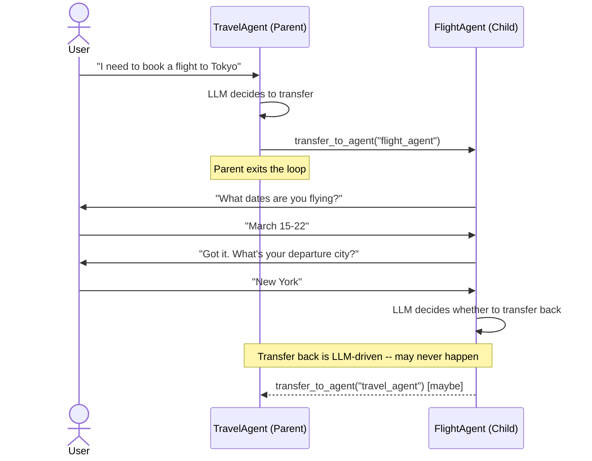
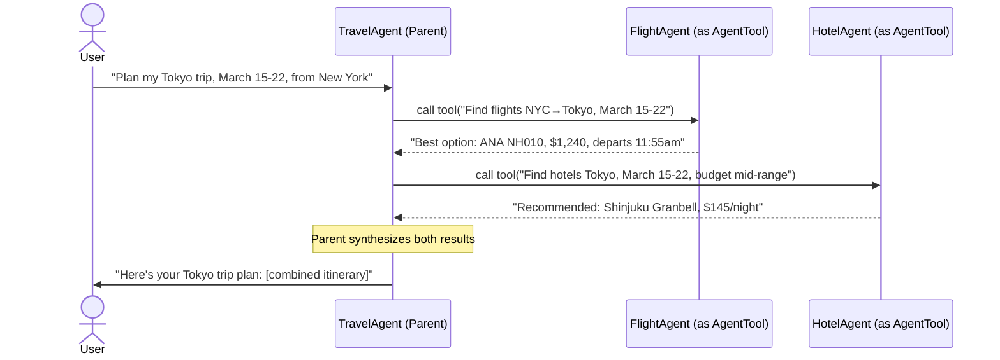

Google ADK gives you two ways to delegate work from a parent agent to a child: sub_agents (transfer_to_agent, child owns the conversation) and AgentTool (child runs in isolation, returns a string, parent synthesizes). They look similar in code but have completely different control flow semantics. This article breaks down both patterns with sequence diagrams and Python examples, covers the "stickiness" gotcha where sub_agents fail to transfer back in production, and gives you a decision framework for choosing between them - including when to reach for workflow agents instead.

## The Setup

You're building a multi-agent system in Google ADK — a travel planner, a research assistant, a customer service router. You have a parent orchestrator and a few specialized child agents. You wire in a child one of two ways. It works in testing. Then in production, one of two things happens: the child never hands control back to the parent and the user is stuck talking to a specialist agent forever, or the parent is synthesizing a response it shouldn't be touching at all. The conversation feels wrong and you're not sure why.

The fix isn't a bug fix. It's a design fix. These two failure modes map directly to which delegation pattern you chose.

## Two Patterns in Plain English

**sub_agents** is a transfer pattern. The parent puts the child agent in a list and the LLM decides when to hand off via `transfer_to_agent()`. At that point, the child owns the conversation — it responds directly to the user, can run multi-turn exchanges, and shares the same session history as the parent. The parent is out of the loop until and unless the child decides to transfer back. That "until and unless" is where things get interesting.

**AgentTool** is an invocation pattern. The child agent is wrapped as a tool. The parent calls it with a string input, the child runs its full reasoning loop in isolation, and returns a string result. The parent then synthesizes a response to the user. The child never communicates with the user directly. Control always returns to the parent — structurally guaranteed, not LLM-dependent.

Same child agent code, completely different runtime behavior depending on which pattern you use.

## Control Flow Diagrams

Here's how sub_agents delegation looks in practice:



And here's AgentTool:



The structural difference is obvious once you see it. In sub_agents, the parent hands off and waits — or doesn't wait at all. In AgentTool, the parent drives the whole conversation and the child is just a smart function call.

## Code Examples

### sub_agents: Transfer Pattern

```python
from google.adk.agents import LlmAgent

# FlightAgent is a specialist -- it owns the flight booking conversation
flight_agent = LlmAgent(
    name="flight_agent",
    model="gemini-2.0-flash",
    instruction="""You are a flight booking specialist.
    Help the user find and select flights.

    When you have gathered all necessary information and completed
    flight selection, transfer back to the travel_agent to continue
    planning the rest of their trip.
    """,  # Explicit transfer-back instruction -- critical for avoiding stickiness
    tools=[search_flights, get_flight_details],
)

# TravelAgent delegates to flight_agent via transfer
travel_agent = LlmAgent(
    name="travel_agent",
    model="gemini-2.0-flash",
    instruction="""You are a full-service travel planner.

    For flight-related requests, transfer to flight_agent.
    For hotel requests, transfer to hotel_agent.
    Coordinate the full trip plan when all components are confirmed.
    """,
    sub_agents=[flight_agent, hotel_agent],  # Children available for transfer
)
```

When the user asks about flights, `travel_agent`'s LLM generates a `transfer_to_agent("flight_agent")` call. The session hands over. `flight_agent` takes the conversation from there — it can ask clarifying questions across multiple turns, run tool calls, and eventually (if the prompt does its job) transfer back.

### AgentTool: Invocation Pattern

```python
from google.adk.agents import LlmAgent
from google.adk.tools.agent_tool import AgentTool

# Same FlightAgent -- but now it's wrapped as a tool
flight_agent = LlmAgent(
    name="flight_agent",
    model="gemini-2.0-flash",
    instruction="""You are a flight search specialist.
    Given a flight query string, search for available options
    and return a structured summary of the best results.
    Return a plain-text summary -- the calling agent will present it to the user.
    """,  # No need for transfer-back instructions -- control always returns
    tools=[search_flights, get_flight_details],
)

hotel_agent = LlmAgent(
    name="hotel_agent",
    model="gemini-2.0-flash",
    instruction="""You are a hotel search specialist.
    Given a hotel query, return a structured summary of available options.
    """,
    tools=[search_hotels, get_hotel_details],
)

# Parent wraps children as AgentTools and synthesizes their output
travel_agent = LlmAgent(
    name="travel_agent",
    model="gemini-2.0-flash",
    instruction="""You are a full-service travel planner.
    Use the flight_agent_tool and hotel_agent_tool to gather options,
    then present a cohesive trip plan to the user.
    """,
    tools=[
        AgentTool(agent=flight_agent),   # Child runs in isolation, returns string
        AgentTool(agent=hotel_agent),    # Can be called in parallel or sequence
    ],
)
```

The parent LLM decides what to query and when. Both child agents run their full reasoning loop and return results. The parent synthesizes. The user only ever hears from the parent.

## Comparison

| Dimension | sub_agents | AgentTool |
| --- | --- | --- |
| Who responds to user | Child | Parent |
| Session history sharing | Shared | Isolated |
| Multi-turn in child | Yes | No |
| LLM hops | Fewer | Extra hop per tool call |
| Control return | LLM-driven (unreliable) | Guaranteed |
| Parallelism | No (use ParallelAgent) | Yes, parent can call multiple |
| Best for | Specialist owns the conversation | Parent synthesizes multiple sources |

The LLM hops difference matters at scale. With AgentTool, every child invocation is an additional LLM call — if your parent queries four specialists, you've got five LLM calls for that turn. With sub_agents, the child talks directly to the user without the parent in the middle. At high volume with expensive models, this is a real cost and latency difference.

## The Stickiness Gotcha

Here's the production failure mode for sub_agents: the child LLM never generates a `transfer_to_agent()` call back to the parent.

The child finishes helping the user with flights. The user says "great, now what about hotels?" — and the flight agent tries to help with hotels instead of transferring back. Or it just says "I only handle flights, please contact our hotel team" and leaves the user stuck. The parent agent never gets control back.

This is well-documented in the ADK GitHub issues (threads #147, #371, and #620 all describe variations of this). The root cause is that `transfer_to_agent()` is an LLM-generated action, not a guaranteed behavior. Whether the child transfers back depends on:

- How clearly the child's system prompt instructs it to transfer
- Whether the LLM judges the current task as "complete"
- The LLM's in-context reasoning at that moment

Three mitigations, in order of reliability:

**1. Explicit transfer instructions in the child prompt.** The most direct fix. Tell the child agent exactly when to transfer back and to whom. "When you have confirmed the user's flight selection, immediately transfer back to travel_agent to continue their trip planning." This helps but doesn't guarantee anything — the LLM still makes the call.

**2. Use workflow agents for deterministic orchestration.** `SequentialAgent` and `ParallelAgent` use `sub_agents` but with fixed control flow — no LLM decides when to hand off. More on this in the next section.

**3. Use AgentTool instead.** Eliminates the problem structurally. If control return reliability matters more than multi-turn child conversations, AgentTool is the right default.

## Workflow Agents — the Deterministic Middle Path

ADK provides `SequentialAgent`, `ParallelAgent`, and `LoopAgent` as built-in orchestration patterns. They use `sub_agents` under the hood, but the control flow is defined in code — not decided by an LLM at runtime.

```python
from google.adk.agents import SequentialAgent

# Steps run in fixed order: flight → hotel → itinerary
# No LLM decides the sequence -- it's deterministic
trip_planner = SequentialAgent(
    name="trip_planner",
    sub_agents=[
        flight_research_agent,   # Runs first, always
        hotel_research_agent,    # Runs second, always
        itinerary_agent,         # Synthesizes results, runs last
    ],
)
```

`SequentialAgent` executes sub-agents in order, passing output from each to the next. `ParallelAgent` runs sub-agents concurrently and collects results. `LoopAgent` repeats until a termination condition is met.

Reach for workflow agents when the orchestration logic is fixed at build time — you know the sequence of steps before the conversation starts. They give you the specialization benefits of sub-agents (each agent owns its domain) without the non-deterministic handoff problem. The tradeoff is flexibility: you can't dynamically decide which agents to invoke based on user intent the way an LLM orchestrator can.

## Decision Framework

Work through these questions in order:

**Does the child need to hold a multi-turn conversation with the user?**

- Yes → sub_agents. The child needs to ask follow-up questions, gather context over several turns, present options and wait for responses.
- No → AgentTool. The child is a smart query — parent asks, child answers, parent synthesizes.

**Does the parent need to query multiple sources and combine the results?**

- Yes → AgentTool. Parent calls each specialist, collects results, synthesizes a coherent response.
- No → sub_agents may be simpler (fewer LLM hops, specialist owns its domain).

**Is the orchestration logic fixed at build time?**

- Yes → Workflow agents (SequentialAgent, ParallelAgent). You know the steps, the order, the termination condition. Don't waste an LLM call to figure out what you already know.
- No → LlmAgent with sub_agents or AgentTool, depending on the answers above.

**Is reliable control return a hard requirement?**

- Yes → AgentTool or workflow agents. Don't bet your reliability on the LLM reliably generating a transfer call.
- No → sub_agents with careful prompt engineering for the return case.

The default rule of thumb: start with AgentTool unless you have a specific reason to need multi-turn child conversations. It's easier to reason about, easier to test, and avoids the stickiness problem entirely.
