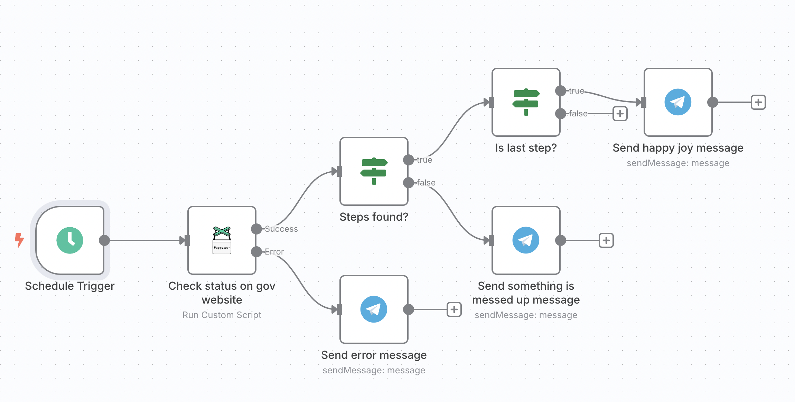
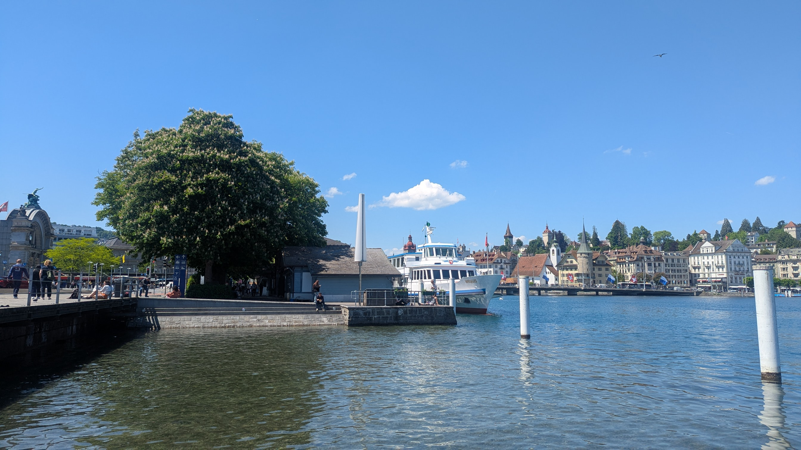

## The Problem

Renewing a passport at the Polish Embassy in Bern, Switzerland, can take from 4 to 8 weeks. The issue? The embassy doesn’t send notifications when the passport is ready. Instead, you have to manually check the status on their website.

Naturally, as a software developer, I wanted to avoid repetitive manual checks. Automating the process seemed like the practical solution.

## The Solution

Since I have n8n running on my server, I decided to use it for this task. The main challenge was that the status check website requires JavaScript, making simple scraping unfeasible. Fortunately, I found [n8n-nodes-puppeteer](https://github.com/drudge/n8n-nodes-puppeteer), which builds on top of the n8n Docker image and adds Puppeteer support.

### Setting Up Puppeteer in n8n

If you’re running n8n via Docker Compose, follow these steps to add Puppeteer support:

1. Clone the repository:

```bash
mkdir -p /home/pasmichal/repos/
cd $_
git clone git@github.com:drudge/n8n-nodes-puppeteer.git
```

2. Adjust your `docker-compose.yml` file:

```yaml
services:
  n8n:
    build:
      context: /home/pasmichal/repos/n8n-nodes-puppeteer/docker
      dockerfile: Dockerfile
    restart: always
    # Needed for puppeteer to launch chromium
    cap_add:
      - SYS_ADMIN
    security_opt:
      - seccomp=unconfined
    # END Needed for puppeteer to launch chromium
    ports:
      - 5678:5678
    environment:
      - N8N_HOST=${SUBDOMAIN}.${DOMAIN_NAME}
      - N8N_PORT=5678
      - N8N_PROTOCOL=https
      - NODE_ENV=production
      - WEBHOOK_URL=https://${SUBDOMAIN}.${DOMAIN_NAME}/
      - GENERIC_TIMEZONE=${GENERIC_TIMEZONE}
    volumes:
      - n8n_data:/home/node/.n8n
      - ${DATA_FOLDER}/local_files:/files

volumes:
  n8n_data:
    external: true
```

### The Automation Workflow



The workflow follows these steps:

1. Schedule a trigger to check the passport status at regular intervals.
2. Use Puppeteer to open the government website, input the passport application number, and check the response.
3. Handle errors, such as network issues or website changes, by sending a Telegram notification.
4. If the passport is ready, send a notification through Telegram.

Core Puppeteer script snippet:

```javascript
await $page.goto('https://moj.gov.pl/uslugi/engine/ng/index?xFormsAppName=SprawdzCzyDokumentPaszportowyJestGotowy');
await $page.waitForSelector('#numerWniosku');

await $page.evaluate(() => {
  // Fill in application number
  const input = document.getElementById('numerWniosku');
  input.value = "{{ TODO: put your application number }}";
  
  // Needed for client side validation to trigger
  input.dispatchEvent(new Event('input', { bubbles: true }));
});

// Submit form
await $page.click('button[type="submit"]');

// Wait for loading to finish
await $page.waitForNetworkIdle();

const steps = await $page.evaluate(() => {
  // Passport production is 3 step process:
  // 1. request
  // 2. production
  // 3. ready
  const listItems = Array.from(document.querySelectorAll('app-steps-list ol li'));
  const activeItemIndex = listItems.findIndex(item => item.classList.contains('active'));

  return {
    totalItemsCount: listItems.length,
    activeItemIndex,
  };
});

// Capture screenshot, useful for debugging
const imageData = await $page.screenshot({ type: "png", encoding: "base64" });

// Return the result in n8n format
return [{
  steps, 
  ...$json,
  binary: {
    screenshot: {
      data: imageData,
      mimeType: "image/png",
      fileName: "screenshot.png",
    },
  },
}];
```

## Final Thoughts

With this automation in place, I no longer need to manually check the passport status every few days. Instead, I get a notification when the passport is ready, saving time and effort. One less thing to think about.

## Bonus

As I had to travel to Bern and on the way back stopped in Lucerne, I took some pics.
Switzerland is truly beautiful and unique!



