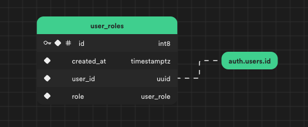
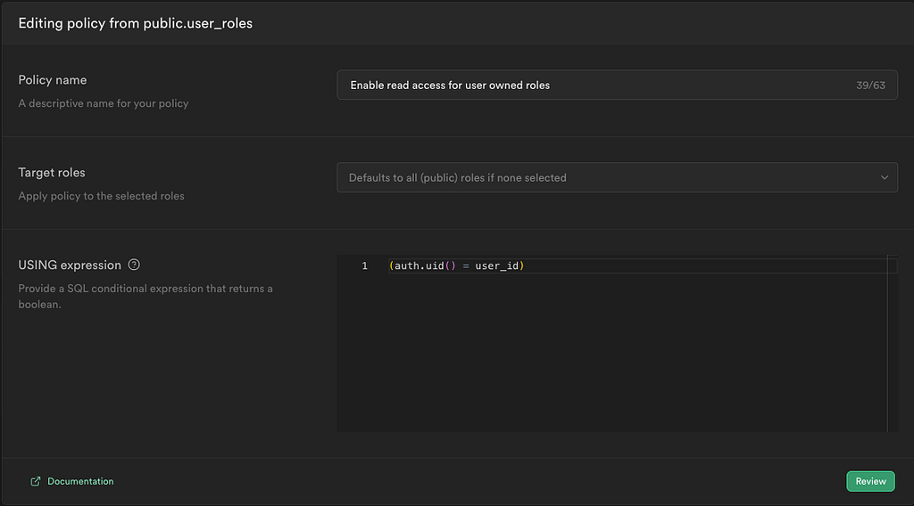
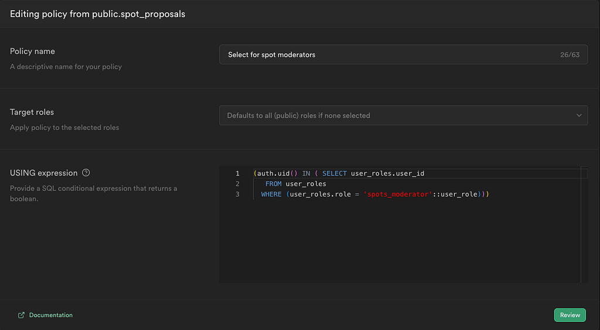

_I posted this as a Twitter thread and it got more attention than I expected (considering my usual standards 😅). Here's a breakdown of how everything comes together._

## 1. Defining Roles

For a more human-friendly approach to referencing roles, you can create a custom enum type:

```sql
CREATE TYPE user_role AS ENUM ('spots_moderator', 'admin');
```

## 2. Setting Up the "user_roles" Table

The `user_roles` table allows us to link roles with users.



To secure `user_roles` enable RLS (Row-level security) and add following policy `auth.uid() = user_id`



This policy grants authenticated users access to read the roles they possess.

Key points:

- `user_id` references `auth.users.id`
- The role is based on the `user_role` type (the enum type from step 1.)
- RLS enables reading of roles owned by the user

## 3. Implementing Row-Level Security for Role-Specific Access

You can now control access to specific rows within a table, such as `spot_proposals` in this case, by users with particular roles. This is done by specifying the following RLS condition:

```sql
(auth.uid() IN ( SELECT user_roles.user_id
   FROM user_roles
  WHERE (user_roles.role = 'spots_moderator'::user_role)))
```



Key points:

- `user_roles` has an RLS policy, allowing authenticated users to read their roles
- The RLS policy on `spot_proposals` restricts access to specific roles, such as `spots_moderator`

This setup ensures a straightforward yet effective role-based access control mechanism in Supabase.
