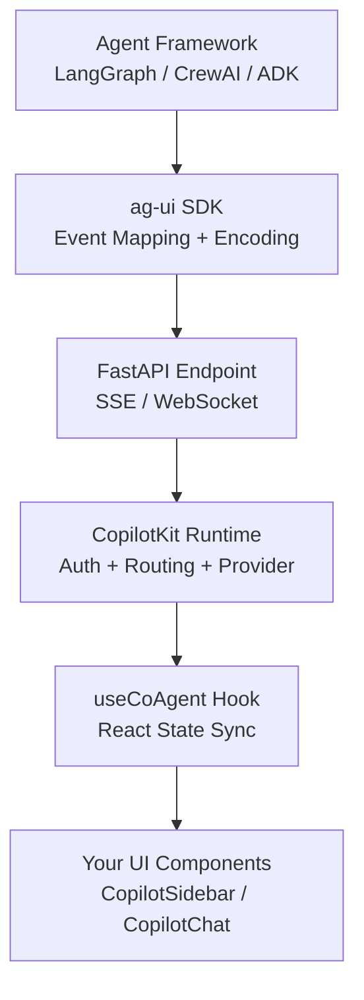
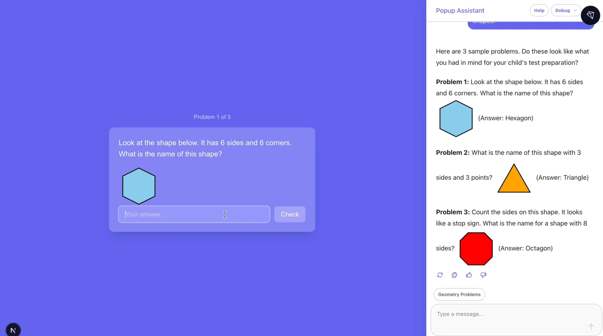

Connecting an agent backend to a real-time UI used to mean custom SSE handlers, proprietary event schemas, and hand-rolled state sync. AG-UI is an open, event-based protocol that standardizes all of it. CopilotKit implements it with React components, a Copilot Runtime, and first-class support for LangGraph, CrewAI, Google ADK, and more. The result is surprisingly simple.

## The Last Mile Problem

You've built a LangGraph agent that works. It reasons, it calls tools, it produces results. Now you want a real-time UI — something that shows tool calls as they happen, streams tokens as they arrive, lets users see the agent's reasoning rather than staring at a spinner for 12 seconds.

The default path to get there is painful. You write a FastAPI endpoint that streams SSE. You define your own event schema — probably something like `{"type": "token", "content": "..."}`. You write a React `useEffect` that opens an `EventSource`, parses those events, and fans them out into component state. You add reconnect logic. You wire up tool call events. You hand-roll state sync between what the agent knows and what the UI shows. You ship it, then six months later you start a new project and do it all again because the schema you invented last time doesn't generalize.

Every team building agents with a UI ends up here. Your LangGraph streaming format is not your CrewAI format. Your SSE shape from project one is incompatible with project two. The frontend has no stable contract to code against, so it gets rewritten whenever the backend changes.

If you've ever written a custom `EventSource` handler that parses `data: {"type": "token", "content": "..."}` off an SSE stream, you've built a one-off AG-UI equivalent. The problem is that it's yours alone.

## Enter AG-UI Protocol

AG-UI is a specification for how agents communicate with front-end interfaces. Think of it the way you think of HTTP or MCP — a protocol that defines a contract, not an implementation. Any agent backend that emits AG-UI events can be consumed by any AG-UI-compatible frontend without custom glue code.

The protocol defines 16 event types across 7 categories:

| Category | Events |
| --- | --- |
| **Lifecycle** | `RUN_STARTED`, `RUN_FINISHED`, `RUN_ERROR` |
| **Text Message** | `TEXT_MESSAGE_START`, `TEXT_MESSAGE_CONTENT`, `TEXT_MESSAGE_END` |
| **Tool Call** | `TOOL_CALL_START`, `TOOL_CALL_ARGS_DELTA`, `TOOL_CALL_END` |
| **Tool Result** | `TOOL_CALL_RESULT` |
| **State Management** | `STATE_SNAPSHOT`, `STATE_DELTA` |
| **Activity** | `STEP_STARTED`, `STEP_FINISHED` |
| **Special** | `MESSAGES_SNAPSHOT`, `RAW` |

That's the full vocabulary. Every agent interaction maps to some subset of these events.

The transport layer is separate from the event model. SSE, WebSockets, HTTP streaming — same events, different pipes. This matters because SSE is dead simple for request/response agent calls but WebSockets make more sense for persistent agent sessions. AG-UI doesn't force a choice.

State sync uses JSON Patch (RFC 6902) for `STATE_DELTA` events. This is a good call — JSON Patch is a well-understood, efficient format for describing mutations to a JSON document. Rather than shipping the full agent state on every update, you ship a diff. The tradeoff is that you need to model your agent's state explicitly upfront, which is genuine work, but it's work you should be doing anyway.

The protocol has adapters for LangGraph, CrewAI, Google ADK, AWS Agents, Pydantic AI, and Microsoft Agent Framework. The adapter handles the mapping from framework-native events to AG-UI events, so your agent code doesn't change.

Every agent run is wrapped in `RUN_STARTED`/`RUN_FINISHED`. Steps within the run get their own `STEP_STARTED`/`STEP_FINISHED` envelope. Tool calls are three events: start (you know a tool call is happening), args delta (the arguments stream in), end (ready to execute). The frontend can render UI at each of these boundaries — not just at the final result.

## Backend integration

Here's a minimal Python FastAPI server implementing AG-UI with Google ADK:

**Full source code for the demo app [github.com/practicallyagents/school-tutor-agent](https://github.com/practicallyagents/school-tutor-agent/blob/main/agent/main.py)**

```python
from ag_ui_adk import ADKAgent, add_adk_fastapi_endpoint
from fastapi import FastAPI
from tutor_agent import tutor_agent # Standard Adk LlmAgent

# Create ADK middleware agent instance
adk_tutor_agent = ADKAgent(
    adk_agent=tutor_agent,
    user_id="demo_user",
    session_timeout_seconds=3600,
    use_in_memory_services=True,
)

# Create FastAPI app
app = FastAPI(title="ADK Middleware Tutor Agent")

# Add the ADK endpoint
add_adk_fastapi_endpoint(app, adk_tutor_agent, path="/tutor")
```

What you're not writing here: reconnect logic, event ID sequencing, custom JSON schema validation, state coordination across events. The `EventEncoder` handles content-type negotiation and serialization. `RunAgentInput` gives you a typed input with thread management built in. The protocol handles the rest.

The full architecture from agent framework to React component looks like this:



The SDK layer is the adapter between your framework and the protocol. Everything above it is your agent code. Everything below it is standardized.

## CopilotKit — AG-UI with the Boring Parts Done



AG-UI defines what goes on the wire. CopilotKit implements the React side and adds the middleware layer that teams always end up building anyway.

The **Copilot Runtime** sits between your frontend and your agent endpoint. It handles authentication, routing requests to different agent backends, and abstracting over LLM provider differences. If you're routing different user requests to different agents (a common pattern once you have more than one agent), the runtime manages that without every agent needing to know about the others.

On the React side, CopilotKit gives you three drop-in UI components:

- `CopilotChat` — full-page chat interface
- `CopilotPopup` — floating overlay, common for assistant-style UIs
- `CopilotSidebar` — side panel that sits alongside existing app UI

The `useCoAgent` hook gives you programmatic access to agent state when you need to build custom UI around it.

The simplest possible setup looks like this:

```tsx
import {
  CopilotKit,
  CopilotSidebar,
} from "@copilotkit/react-ui";
import "@copilotkit/react-ui/styles.css";

function App() {
  return (
    // Point CopilotKit at your Copilot Runtime endpoint
    <CopilotKit runtimeUrl="/api/copilotkit">
      <YourExistingApp />
      {/* Sidebar renders alongside your app, not replacing it */}
      <CopilotSidebar
        defaultOpen={false}
        labels={{ title: "Assistant" }}
      />
    </CopilotKit>
  );
}
```

That's the full integration for a sidebar chat interface. The `CopilotKit` provider handles the connection to the runtime and makes agent state available to all child components.

When you need to read or update shared agent state, `useCoAgent` gives you bidirectional access:

```tsx
import { useCoAgent } from "@copilotkit/react-core";

// AgentState is your typed state shape -- matches what
// the agent emits via STATE_SNAPSHOT and STATE_DELTA events
interface AgentState {
  currentStep: string;
  searchResults: SearchResult[];
  isResearching: boolean;
}

function ResearchPanel() {
  const { state, setState } = useCoAgent<AgentState>({
    name: "research_agent",
    // Initial state before agent emits its first STATE_SNAPSHOT
    initialState: { currentStep: "", searchResults: [], isResearching: false },
  });

  // state.searchResults updates in real-time as STATE_DELTA events arrive
  // setState sends state updates back to the agent
  return (
    <div>
      {state.isResearching && <Spinner label={state.currentStep} />}
      <ResultsList results={state.searchResults} />
    </div>
  );
}
```

The `state` object updates automatically as `STATE_DELTA` events arrive from the agent. `setState` sends changes back. You get bidirectional state sync without writing a single WebSocket handler.

Human-in-the-loop is worth calling out specifically. Because tool calls arrive as discrete events (`TOOL_CALL_START` before `TOOL_CALL_RESULT`), you can intercept between them to show an approval UI. CopilotKit has built-in support for this pattern — the agent pauses at the tool call boundary, waits for user confirmation, then continues. This is the kind of thing that normally requires significant custom work with a custom approval state machine bolted onto your agent loop.

## What This Actually Unlocks

The immediate benefit is obvious — you stop writing streaming glue code. But the protocol unlocks things that go beyond convenience.

**Generative UI becomes tractable.** When the frontend has a structured event stream with typed boundaries (tool calls are distinct from text messages, state changes are explicit), you can render different components based on agent state. A `TOOL_CALL_START` for a "search" tool shows a search animation. A `STATE_DELTA` updating `currentDocument` triggers a document panel to open. This is only possible when the frontend has a reliable, typed signal — not a raw token stream.

**Tool call visibility changes the user experience.** Users see `TOOL_CALL_START` before the result arrives. That's a window into reasoning, not a spinner. For agent workflows that take 15-30 seconds, showing "searching the web for X" followed by "reading document Y" dramatically changes perceived performance and trust.

**Cross-framework portability is real.** If you start with LangGraph and later move to CrewAI (or run both), the frontend doesn't change. The adapter handles the mapping. This is the same value proposition MCP delivers for tool interfaces — you write the tool once and any agent framework can call it. AG-UI delivers the same for UI clients — you build the frontend once and any compliant agent backend can drive it. MCP standardizes agent-to-tool interfaces; AG-UI standardizes agent-to-UI interfaces. They're complementary layers of the same stack.

## The Trade-offs

AG-UI is young. The spec is at v0 and the ecosystem is still thin. CopilotKit is the primary production consumer today, which means you're betting on CopilotKit's priorities aligning with yours. The non-React story is incomplete — if you're building a Vue or Svelte frontend, you'll need to implement the client side yourself from the spec, which is doable but not "drop-in."

The event model assumes streaming. If your agent produces batch outputs (think: a document generation pipeline that runs for a minute then returns a complete artifact), you pay the event overhead without getting the streaming benefit. `TEXT_MESSAGE_CONTENT` chunks for a response that arrives all at once is extra complexity with no user experience payoff.

JSON Patch state sync is elegant once it's working, but it requires you to explicitly model your agent's shared state as a typed JSON document. This is good engineering discipline — you should be doing it anyway — but it's real design work upfront. If your agent's state is implicit and spread across multiple variables, you'll need to consolidate it before AG-UI's state sync is useful to you.

The LangGraph adapter handles event mapping automatically, which is convenient. But it also abstracts over LangGraph's native streaming events, so if you're using LangGraph-specific streaming features, verify the adapter exposes them correctly before committing.

## Demo Project

I built a school tutor agent to show this stack end-to-end — a Google ADK agent on the backend, a React frontend with CopilotKit. Clone it, `pnpm install`, set your API key, `pnpm dev`.

**Source: [github.com/practicallyagents/school-tutor-agent](https://github.com/practicallyagents/school-tutor-agent)**
